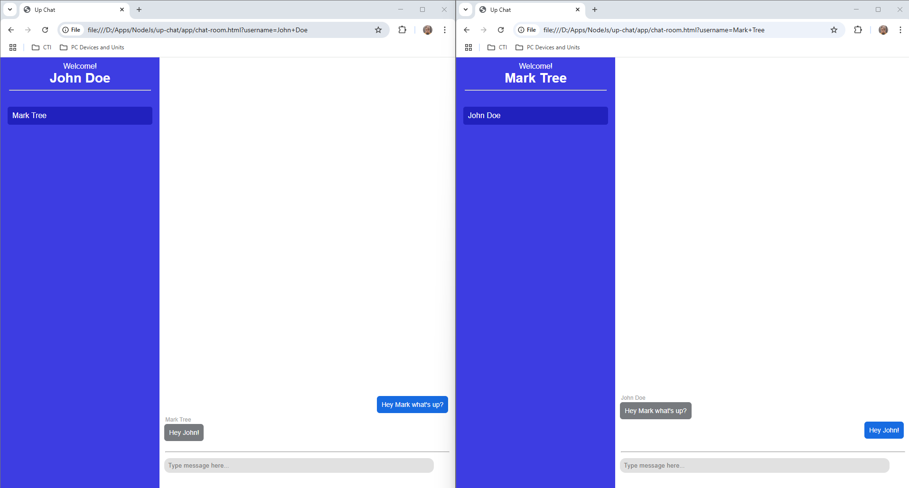

# Intro
Simple Chat Room application using nodejs and socket.io. Hobby project to enhance my skills in web socket.

# Reminders
 1. This app is not using any databases. It uses variables only for data storage of users and messages.
 2. Run **npm init** first before running this app.
 3. To start the app, cd to the **/server** folder and run the server(**npm start**). After that open the **index.html** inside the **/app** folder and you should see the UI for joining the chat room.

 ## Some screenshots for the app
 

